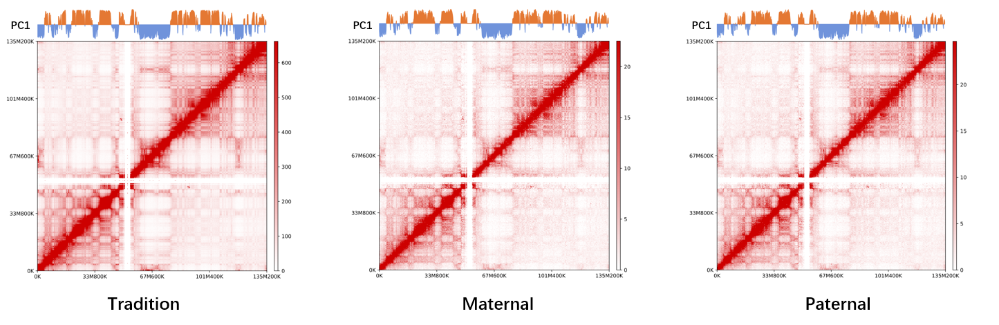
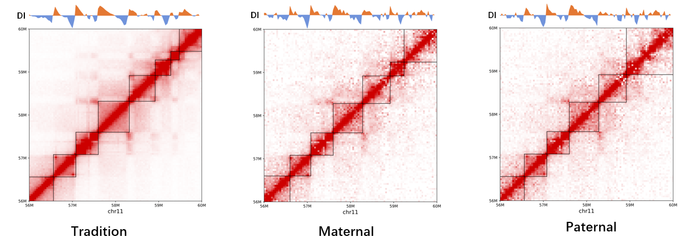
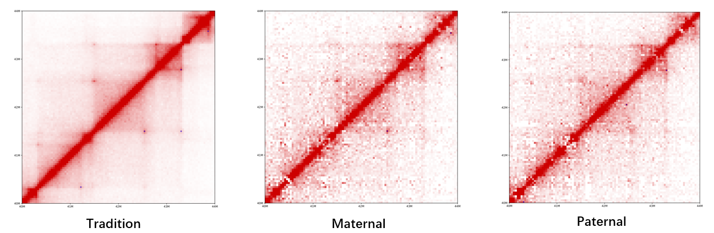
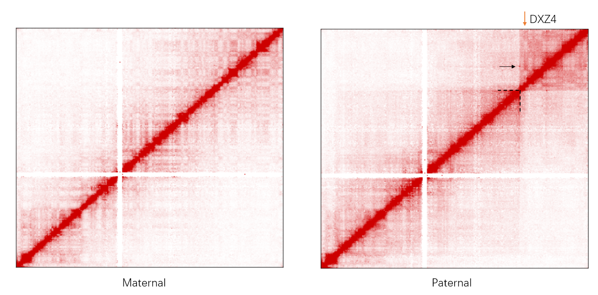
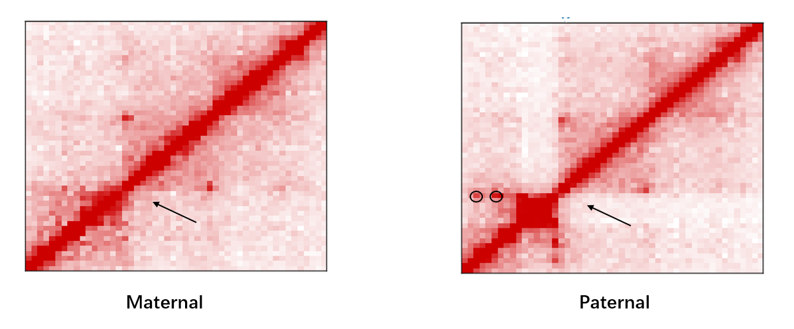

## HiCHap
**HiCHap** provide a Python CPU-based implementation for Hi-C pipeline. Tranditional Hi-C pipeline and Haplotype-resolved Hi-C pipeline are both available.

**Download** :

 [PyPI](https://pypi.org/project/HiCHap/) : (https://pypi.org/project/HiCHap/)

 [Github](https://github.com/Prayforhanluo/HiCHap_master) : (https://github.com/Prayforhanluo/HiCHap_master)
 

### Requirement
1.  Python 2.7+
2.  Multiprocess 
3.  Numpy
4.  Scipy
5.  statsmodels
6.  Scikit-Learn
7.  xml
8.  mirnylib
9.  pysam
10.  ghmm
11.  Bio
12.  bowtie2 (we used 2.2.9)
13.  samtools (we used 1.5)
14.  cooler
 
Using **conda** , **pip** or their source code to install them if neccessary.

### Install HiCHap

Now just download the HiCHap source code and gunzipped the files from PyPI or Github, and run the setup.py script::

	$ python setup.py install

OR 

	$ pip install HiCHap

By the way, When I developed HiCHap, I have found a strange bug. when HiCHap has been installed, I use the hichap -h to get help information. But it bugs with **"pkg_resources.ResolutionError::"**. I just figure out how to fix it but i can't figure out why it happens. The fixing code is in the setup.py at the last few lines.
If anyone can tell me how to avoid this bug. Please connect with me (hluo_lc@outlook.com) and thanks so much :)

**HiCHap** will be installed successfully if no exception occurs in the above process.

### Input data formats
##### Hi-C data
Format of Hi-C data is fastq.gz(or unzipped fastq). And canonical name will be nice. for example::

	$ ls -lh
	
	-rw-r--r-- 1 hluo CPeng 42G Sep 14 00:30 GM12878_R1_1.fastq.gz
	-rw-r--r-- 1 hluo CPeng 42G Sep 14 00:30 GM12878_R1_2.fastq.gz

Both compresssed and uncompressed fastq data are available for Hi-C data

##### genome data
Format of genome data is .fa, make sure that all the versions of genome that contribute to other data (such as SNPs, mapping genome) are matched.

	$ ls -lh
	
	-rwxr-xr-- 1 hluo CPeng 2780868912 Sep  4  2017 mm10.fa
	-rwxr-xr-- 1 hluo CPeng 3187102198 Sep  4  2017 hg19.fa

##### SNPs data
Format of SNPs data is self-defined and essential for haplotype Hi-C pipeline. We need a TXT-like type file as  input.(.txt)
The file has five columns : 

1.  chromosome ID
2.  genome position
3.  reference base
4.  Maternal base
5.  Paternal base

For example::
	
	$ ls -lh
	
	-rw-r--r-- 1 hluo CPeng 56524229 Mar  9 11:07 GM12878_F1_maternal_paternal_SNP.txt

	$ head -5 GM12878_F1_maternal_paternal_SNP.txt

	1	10492	C	T	C
	1	10927	A	A	G
	1	10938	G	G	A
	1	13302	C	C	T
	1	13813	T	G	T

### How to use HiCHap ?
First, try to get the help message! The executable code in the command line of HiCHap is **hichap**.

HiCHap has the general parameters : -w (--workspace), -log (--logfile) and -N (--NonAllelic).

There is a closer logical connection between hichap modules. The input of next sub-command may be the output of the previous module. For the simplicity, **hichap** will output the results to workspace by default and search the input in the workspace.For the oprability, users also can set the  for input and output path by themselves.

If -N (--NonAllelic) is set on the sub-command. the sub-module will running traditional Hi-C pipeline.

Try to get help information:
	
	$ hichap --help
	
	usage: hichap [-h] [-v] {rebuildG,rebuildF,GlobalMapping,Rescue,ReMapping,bamProcess,filtering,matrix}
	...
	...

There are several major functions available in HiCHap serving as  sub-commands.

Subcommand | Description
-----------|----------
rebuildG |  Build Genome index, genome size and enzyme fragment locations
rebuildF |  Chunk fastq files.
GlobalMapping | Mapping the raw chunked reads to genome
Rescue | Rescue the unmapped reads by cutting the Ligation site.
ReMapping | Re-mapping the resuced reads to genome
bamProcess |  Integrate all the mapping informations
filtering |  Hi-C filtering and Allelic assignment (if neccessary).
matrix | Interaction Matrix Construction

Please use 'hichap SUB-COMMAND -h' to see the detail description for each option of each
module.

### rebuildG
For traditional Hi-C pipeline, build the genome index and enzyme fragments location for genome.

The command line eg ::

	$ hichap rebuildG -w ./GM12878 -log ./GM12878.log -N -g ./hg19.fa -e MboI -t 4

For haplotype-resolved Hi-C pipeline, build the maternal/paternal genome and their index, enzyme fragments.
The command line eg ::
	
	$ hichap rebuildG -w ./GM12878 -log ./GM12878.log -g ./hg19.fa -S ./GM12878_F1_maternal_paternal_SNP.txt -e MboI -t 4

After rebuildG, a genome Folder (./GM12878/genome) contains the genome Index and fragments location txt will be created under the workspace(./GM12878)

### rebuildF
Chunking the fastq by a given step. The command line eg ::

	$ hichap rebuildF -w ./GM12878 -log ./GM12878.log -1 GM12878_R1_1.fastq.gz -2 GM12878_R1_2.fastq.gz -c 4000000 -t 2

After rebuildF, a folder(./Genome/fastqchunks) contains the chunked files will be created under the workspace(./Genome) eg:

	$ ls -lh ./Genome/fastqchunks
	
	-rw-r--r-- 1 hluo CPeng 410M Nov 13 10:44 GM12878_R1_chunk0_1.fastq.gz
	-rw-r--r-- 1 hluo CPeng 410M Nov 13 10:43 GM12878_R1_chunk0_2.fastq.gz
	...
	...
	-rw-r--r-- 1 hluo CPeng 407M Nov 13 10:49 GM12878_R1_chunk9_1.fastq.gz
	-rw-r--r-- 1 hluo CPeng 406M Nov 13 10:48 GM12878_R22_chunk9_2.fastq.gz

### GlobalMapping

After genome rebuilding and fastq chunking, You need to start mapping tasks. Each chunk means a single mapping task. We will try to reduce the cost of time by  parallel mode. And for the different operating environment, two sets of  Mapping API is designed for users.
#### 1. PBS-Mode

If you use the clusters (based on PBS for job management), you can choose the PBS API for less time spending. You can submit N tasks to the computation nodes and M threads used for each task. 

For traditional Hi-C pipeline, the index parameter only have one chooice. For example:

	$ nohup hichap GlobalMapping -w ./GM12878 -log GM12878.log -b ~/tools/bowtie2/bowtie2 -i ./GM12878/genome/hg19/hg19 
	 -m PBS -pt 10 4 &

For Haplotype-resolved Hi-C pipeline, the index parameter should have two index. Maternal first, Paternal follows. For example:

	$ nohup hichap GlobalMapping -w ./GM12878 -log GM12878.log -b ~/tools/bowtie2/bowtie2 -i ./GM12878/genome/Maternal/Maternal 
	./GM12878/genome/Paternal/Paternal -m PBS -pt 10 4 &

##### Make sure that this command-line is running on the login node or the node where jobs are submitted.
The key parameter of this command -m(--mode) must be PBS. -pt (--PBSthreads) 10 4 means running 10 chunks mapping tasks parallely, and each task use 4 threads. That is, 40 cores of clusters will be occupied. Using the **qstat** to check the tasks.

	$ qstat

	Job ID                    Name             User            Time Use S Queue
	------------------------- ---------------- --------------- -------- - -----          
	2266086.admin              GM12878_R1      hluo                   0 R batch          
	2266087.admin              GM12878_R1      hluo                   0 R batch          
	2266088.admin              GM12878_R1      hluo                   0 R batch          
	2266089.admin              GM12878_R1      hluo                   0 R batch          
	2266090.admin              GM12878_R1      hluo                   0 R batch          
	2266091.admin              GM12878_R1      hluo                   0 R batch          
	2266092.admin              GM12878_R1      hluo                   0 R batch          
	2266093.admin              GM12878_R1      hluo                   0 R batch          
	2266094.admin              GM12878_R1      hluo                   0 R batch          
	2266095.admin              GM12878_R1      hluo                   0 R batch

#### 2. WS-Mode
If you are not using the cluster system.Us WS API to start mapping tasks.

For traditional Hi-C pipeline, the index parameter only have one index. For example:

	$ hichap GlobalMapping -w ./GM12878 -log GM12878.log -b ~/tools/bowtie2/bowtie2 -i ./GM12878/genome/hg19/hg19 -m WS -wt 16
For haplotype-resolved Hi-C pipeline, the index parameter should have two index. Maternal first, Paternal followed. For example:

	$ hichap GlobalMapping -w ./GM12878 -log GM12878.log -b ~/tools/bowtie2/bowtie2 -i ./GM12878/genome/Maternal/Maternal 
	./GM12878/genome/Paternal/Paternal -m WS -wt 16

The key parameter of this command -m(--mode) must be WS. -wt (--PBSthreads) 16 means that the total threads we will share for 4 mapping tasks. That is, 4 chunk mapping tasks are running paralelly and each task occupies 4 threads.

### Rescue
Reads rescue. For unmapped reads in GlobalMapping, hichap will search the ligation-site and using the resuce mode to make full use of sequence information on reads.

For traditional Hi-C pipeline:
	
	$ hichap Rescue -w ./GM12878 -log GM12878.log -e MboI -t 8 -N

For haplotype-resolved Hi-C pipeline:
	
	$ hichap Rescue -w ./GM12878 -log GM12878.log -e MboI -t 8 

### ReMapping

Except for the inputs, the other parameters are same as **GlobalMapping** . Try -h(--help) for more informations.

###bamProcess
Integrate all the mapping informations.

For traditional Hi-C pipeline, the fragment parameter(-f) only have one fragment location file and the SNP parameter should be defualt (None). For example:

	$ hichap bamProcess -w ./GM12878 -log ./GM12878.log -N -f ./GM12878/genome/GATC_hg19_fragments.txt -t 16 --rfo

For haplotype-resolved Hi-C pipeline, the fragment parameter(-f) should have two fragment location files. Maternal first and Paternal followed. The SNP parameter should be set. For example:

	$ hichap bamProcess -w ./GM12878 -log ./GM12878.log -f ./GM12878/genome/GATC_Maternal_fragments.txt 
	  ./GM12878/genome/GATC_Paternal_fragments.txt -s ./GM12878/genome/SNPs/Snps.pickle -t 16 --rfo

The parameter --rfo means unique reads filtering softly. If your sequence data has a high sequencing depth, you can remove this parameter but indeed hurt the data utilization.

### filtering
The **filtering** sub-command of **hichap** is designed to preform some basic filtering on the aligned Hi-C read pairs:

##### Hi-C filtering
1. Remove redundant PCR duplicates
2. Remove the read pair that maps to the same restriction fragment

##### Allelic assignment

1.  assignment maternal interaction pairs
2.  assignment paternal interaction pairs
3.  assignment regroup  interaction pairs

Here's the command you should type in the terminal:

For traditional Hi-C pipeline

	$ hichap filtering -w ./GM12878 -log ./GM12878.log  -N -t 16

For haplotype-resolved Hi-C pipeline

	$ hichap filtering -w ./GM12878 -log ./GM12878.log -t 16

After this sub-command, some bed files will created under the workspace. "Filtered_Bed" Folder for traditional Hi-C pipeline, "Allelic_Bed" Folder for haplotype-resolved Hi-C pipeline.The main file is "**_Valid_sorted.bed". It has 23 columns. That is the Hi-C valid interaction pairs. you can do some custom processing with this file.The description of each column is :

-------  | Hi-C interaction pairs 
--------| ----------
column | description
1 | Pair Name
2 | R1 mate Reference
3 | R1 mate Strand
4 | R1 mate Position
5 | R1 mate Length
6 | R1 mate AS score
7 | R1 mate Fragment Middle point
8 | R1 mate SNP Matching num (Non-haplotype results in 0)
9 | R1 mate Reference
10 | R2 mate Strand
11 | R2 mate Position
12 | R2 mate Length
13 | R2 mate AS score
14 | R2 mate Fragment Middle point
15 | R2 mate SNP Matching num (Non-haplotype results in 0)
-------- | candidate mate if it is possible
16 | Candidate mate Reference
17 | Candidate mate Strand
18 | Candidate mate Position
19 | Candidate mate Length
20 | Candidate mate AS score
21 | Candidate mate Fragment Middle point
22 | Candidate mate SNP Matching num (Non-haplotype results in 0)
23 | Candidate Index for which mate.

For haplotype-resolved Hi-C pipeline.the results files of haplotype interactions have the target like "M_M", "P_P", "M_P", "P_M", "Bi_Allelic".The "M_M" represent the maternal-maternal interactions. The "M_P" represent the maternal-paternal interactions. "Bi_Allelic" represent can't assign to parent. The files have 5 columns. The decription of each column is :

----- | Haplotype Hi-C interactions
------| --------------------------
column|description
1 | chromosome ID for interaction loci 1
2 | fragment ID for interaction loci 1
3 | chromosome ID for interaction loci 2
4 | fragment ID for interaction loci 2
5 | assignment target (R1 means assigned by R1, R2 means assigned by R2, Both means both mate can be assigned)

### matrix
Interaction Matrix Construction. Finally, cooler format file will be generate.
For this sub-command, U need to set the output-folder path. the matrix wiill be saved in cooler files at different resolutions.
For traditional Hi-C pipeline
	
	$ hichap matrix -b GM12878_R1_workspace/Filtered_Bed GM12878_R2_worspace/Filtered_Bed -N -o ./GM12878_Matrix 
	  -gs ./genome/genomeSize -wR 2000000 1000000 -lR 200000 40000 20000 

For haplotype-resolved Hi-C pipeline

	$ hichap matrix -b GM12878_R1_workspace/Allelic_Bed GM12878_R2_workspace/Allelic_Bed -o ./GM12878_Matrix 
	 -gs ./genome/genomeSize -wR 5000000 2000000 -lR 500000 40000

The Imputation parameters can be changed. try help for more information.
	
!!!Notice !!!
The traditional matrix in cool are balanced by ICE.
The haplotype-resolved matrix in cool are not balanced. The raw count value are already corrected by HiCHap and the type is float.
The Gap file are saved into NPZ file.U can use numpy to load it.

### How to get matrix with python code.

Loading the Matrix in cooler. Open a python interpreter and follow the code below:

	>>> import cooler
	>>> GM12878_T = cooler.Cooler('Merged_Traditional_Multi.cool::40000')
	>>> GM12878_T.matrix(balance = False).fetch('1')     #Get the raw chromosome 1 Matrix
	>>> GM12878_T.matrix(balance = True).fetch('1')      #Get the balanced chromosome 1 Matrix
	>>> # Haplotype-resolved Matrix 
	>>> GM12878_Haplotype = cooler.Cooler('Merged_Imputated_Haplotype_Multi.cool::40000')
	>>> GM12878_Haplotype.matrix(balance = False).fetch('M1')   #Get chromosome 1 Maternal Matrix
	>>> GM12878_Haplotype.matrix(balance = False).fetch('P1')   #Get chromosome 1 Paternal Matrix

More infomation about cooler [here](https://cooler.readthedocs.io/en/latest/)

### Chromosome Structure Analysis

Chomosome structure analysis is integrated in the module **StructureFind**. The source code can be found in the lib/StructureFind.py.

Use the API like :

	>>> from HiCHap.StructureFind import StructureFind
	
	>>> #============= Compartment==============
	>>> ## For traditional Hi-C
	>>> GM_T_PC = StructureFind(cooler_fil = 'Merged_Traditional_Multi.cool', Res = 500000, Allelic = False)
	>>> GM_T_PC.run_Compartment(OutPath = 'Traditonal_PC', plot = True, MS = 'IF', SA = False)
	 
	>>> ## For haplotype-resolved Hi-C 
	>>> GM_M_PC = StructureFind(cooler_fil = 'Merged_Imputated_Haplotype_Multi.cool', Res = 500000, Allelic = 'Maternal')
	>>> GM_M_PC.run_Compartment(OutPath = 'Maternal_PC', plot = True, MS = 'IF', SA = False)
	
	>>> GM_P_PC = StructureFind(cooler_fil = 'Merged_Imputated_Haplotype_Multi.cool', Res = 500000, Allelic = 'Paternal')
	>>> GM_P_PC.run_Compartment(OutPath = 'Paternal_PC', plot = True, MS = 'IF', SA = False)

	
	>>> #============= TADs calling=============
	>>> ## For traditional Hi-C 
	>>> GM_tads_T = StructureFind(cooler_fil = 'Merged_Traditional_Multi.cool', Res = 40000, Allelic = False)
	>>> GM_tads_T.run_TADs(OutPath = 'Traditional_TADs', plot = True)
	>>>
	>>> ## For haplotype-resolved Hi-C
	>>> GM_tads_M = StructureFind(cooler_fil = 'Merged_Imputated_Haplotype_Multi.cool', Res = 40000, Allelic = 'Maternal')
	>>> GM_tads_M.run_TADs(OutPath = 'Maternal_TADs', plot = True)

	>>> GM_tads_P = StructureFind(cooler_fil = 'Merged_Imputated_Haplotype_Multi.cool', Res = 40000, Allelic = 'Paternal')
	>>> GM_tads_P.run_TADs(OutPath = 'Paternal_TADs', plot = True)
	

	>>> #============= Loops calling=============
	>>> ## For traditonal Hi-C
	>>> GM_Loop_T = StructureFind(cooler_fil = 'Merged_Traditional_Multi.cool', Res = 40000, Allelic = False)
	>>> GM_Loop_T.run_Loops(OutPath = 'Traditional_Loops', plot = True)
	
	>>> ## For haplotype-resolved Hi-C
	>>> GM_Loop_M = StructureFind(cooler_fil = 'Merged_Imputated_Haplotype_Multi.cool', Res = 40000, Allelic = 'Maternal')
	>>> GM_Loop_M.run_Loops(OutPath = 'Maternal_Loops', plot = True)
	
	>>> GM_Loop_P = StructureFind(cooler_fil = 'Merged_Imputated_Haplotype_Multi.cool', Res = 40000, Allelic = 'Paternal')
	>>> GM_Loop_P.run_Loops(OutPath = 'Paternal_Loops', plot = True)
	
	

That is ! Notice that the the Most important parameter is **Allelic**. **False** for traditional Hi-C and **Maternal/Paternal** for Maternal/paternal. 

The detailed calculation parameters can be set. Read the source code in StuctureFind.py 

#### The Structure examples:

#### Compartment:

#### TADs:

#### Loop:

### Allel-Specificity of Chromatin Structure 
The calculation method of Allelic Speicficity is integrated in the **AllelicSpecificity** module.

#### Compartment Allel-Specificity calculating

Using the maternal and paternal PC1 values as input.Format as 

1) chromomsome ID. 2) PC1 values

Each row indicates a chromatin bin and its pc values. Bins are ordered from 5' to 3'.

	$ less GM12878_Maternal_PC.txt

	  1	   0.007763622511004936
	  1	   0.03661900228230602
	  1	   0.031072969611405883
	  1	   0.03303907288771536
	  1	   0.03185222709883546
	  ...

Use the API like:
	
	>>> from HiCHap.AllelicSpecificity import CompartmentAllelicSpecificity
	
	>>> Allel_PC = CompartmentAllelicSpecificity(Maternal_PC = 'GM12878_Maternal_PC.txt',
	                                            Paternal_PC = 'GM12878_Paternal_PC.txt',
												Res = 500000)
	
	>>> Allel_PC.Running('Output.txt')

#### Boundary Allel-Specificity calculating

Using the Candidate boundaries as input. TXT file contains 3 columns format as 

1) chromosome ID. 2) Maternal Boundary 3) Paternal Boundary

Each row indicates a pair of candidate boundary to calculate the allel-specificity. Maternal and Paternal boundary can be different(Same boundary but results a little translation.) But we suggest the distance of translation should less than 3 bins.

	$ less Candidate_Boundary.txt

		1       800000  800000
		1       1240000 1240000
		1       1680000 1680000
		1       1840000 1840000
		1       2080000 2040000
		1       2320000 2320000
		...

Use the API like:
	
	>>> from HiCHap.AllelicSpecificity import BoundaryAllelicSpecificity
	
	>>> Allel_Boundary = BoundaryAllelicSpecificity(cooler_fil = 'Merged_Imputated_Haplotype_Multi.cool',
													Boundary_fil = 'Candidate_Boundary.txt',
													Res = 40000, offset = 10)
	
	>>> Allel_Boundary.Running('OutPut.txt')

#### Loop Allel-Specificity calculating

Using the Candidate loops as input. TXT file contains 5 columns format as 

 1)  chromosome ID. 2) Maternal loop loci 1. 3) Maternal loop loci 2. 4) Paternal loop loci 1. 5) Paternal loop loci 2

	$ less Candidate_Loop.txt

		1       2320000         2560000         2320000         2560000
		1       13840000        14160000        13840000        14160000
		1       35320000        35640000        35320000        35640000
		1       47640000        48160000        47640000        48160000
		...

Use the API like:
	
	>>> from HiCHap.AllelicSpecificity import LoopAllelicSpecificity
	
	>>> Allel_Loop = LoopAllelicSpecificity(cooler_uri = 'Merged_Imputated_Haplotype_Multi.cool',
											Loop_file = 'Candidate_Loop.txt',
											Res = 40000)

	>>> Allel_Loop.Running('OutPut.txt')

### Example of Allel-Specific Structure

#### X-Chromosome-Inactivation

#### Allel-Specific Boundary and Loop

